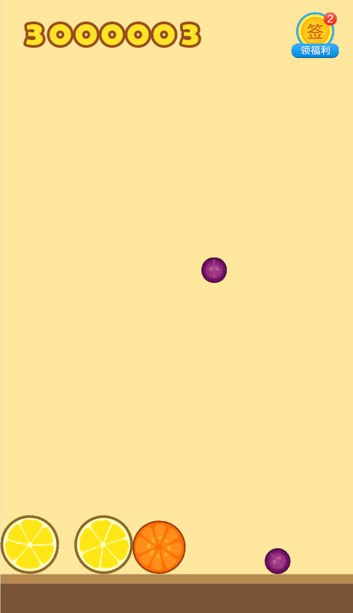

## 合成大西瓜

**声明，本项目仅帮助大家学习技术及娱乐，切勿将修改后的网站大规模传播及商用，以避免侵权！**

> 最简单的魔改发布『 合成大西瓜 』，不用改代码，修改配置即可！
>
> 有帮助的话，求个大大的 star，有疑问请联系 wx：liyupi66
> 
> 遇到问题可以先阅读本文档最后[『 问题及解决 』](#问题及解决)

1 月 31 日晚 21 点，bilibili 直播交流，[程序员鱼皮](https://space.bilibili.com/12890453)  

详细教程：[魔改和上线你的合成大西瓜，最全教程！](https://mp.weixin.qq.com/s/H9VR1MWn-9bKSC_1l_MkJw)

视频教程：[全网最贴心的魔改合成大西瓜教程，从修改到发布！](https://www.bilibili.com/video/BV1Vy4y1n7KW/)

未修改版在线玩：[https://daxigua.liyupi.com](https://daxigua.liyupi.com)

魔改版在线玩：[https://dadaxigua.liyupi.com](https://dadaxigua.liyupi.com)

未修改版源码：https://github.com/liyupi/daxigua/releases/tag/1.0.0



### 本地启动

1. 安装 serve 工具：

    ```bash
    npm i -g serve
    ```

2. 进入 daxigua 目录，运行 serve：

    ```bash
    serve
    ```
   
3. 打开浏览器访问 localhost:5000 即可！

### 快速魔改

> 按照下列说明修改即可，持续补充

1. 改分数：改 extraSettings.js 文件

2. 改图片：替换 res/raw-assets 目录下指定目录的图片，必须同文件名、后缀、尺寸，成功覆盖可生效，[可替换素材文档](https://docs.qq.com/sheet/DS0d2VVVJYmpvZ0pZ)

3. 无敌模式：改 extraSettings.js 文件

4. 指定第一个水果：改 extraSettings.js 文件

5. 指定下次出现的水果：改 extraSettings.js 文件

6. 大水果合成小水果：在 project.js 代码中搜索 "大水果合成小水果"

7. 让水果更 Q 弹：改 extraSettings.js 文件，[原理参考](https://docs.cocos.com/creator/api/zh/classes/PhysicsCircleCollider.html?h=circlecollider)

8. 水果下落速度减缓：改 extraSettings.js 文件，[原理参考](https://docs.cocos.com/creator/manual/zh/physics/physics/rigid-body.html?h=%E5%88%9A%E4%BD%93)

9. 替换音乐：，覆盖 res/raw-assets 目录下相同的音乐，[可替换素材文档](https://docs.qq.com/sheet/DS0d2VVVJYmpvZ0pZ)

10. 替换背景：和改图片原理相同，[可替换素材文档](https://docs.qq.com/sheet/DS0d2VVVJYmpvZ0pZ)

11. 去广告：将广告图片替换为[同背景色底图](https://636f-codenav-8grj8px727565176-1256524210.tcb.qcloud.la/0.png)

12. 替换广告链接：改 extraSettings.js 文件

13. 改网站标题：改 extraSettings.js 文件

14. 开启选分弹窗：改 extraSettings.js 文件


### 魔改原理

请先阅读：[魔改和上线你的合成大西瓜，最全教程！](https://mp.weixin.qq.com/s/H9VR1MWn-9bKSC_1l_MkJw)

我给 `project.js` 文件补充了注释，大家可以搜索关键字，如 "改分" 来快速定位，学习修改原理。

### 问题及解决

1. 无法安装 serve 或者 Vercel？

    答：如果报找不到 npm，请先安装 npm。

    如果安装中卡住，试着按下键盘（可能假死），还不行的话先用 npm 安装 cnpm（国内镜像，比较快）：
    
    ```bash
    npm install cnpm -g --registry=https://registry.npm.taobao.org 
    ```
    
    再用 cnpm 安装： `cnpm i -g serve` 或 `cnpm i -g vercel`
    
2. Vercel 网址被微信拦截怎么办？
   
    答：可以把网址复制到浏览器打开，也可以申请一个域名，在 Vercel 和服务提供商配置域名解析。
    Vercel 基本是海外的服务器，无需备案。

3. 怎么在电脑上浏览网页游戏？
   
    答：在浏览器中，按 F12 打开开发者工具，点击像手机一样的图标即可。
    
4. 为什么 serve 后，打开网页一片空白？

    答：大概率是你在错误的目录下执行了 serve，请务必在 index.html 所在的文件夹下执行 serve。

5. 执行 vercel 命令显示 signUp？

    答：要先去 [Vercel 官网](https://vercel.com/) 注册。

6. vercel 邮箱验证失败？

    答：先确认邮箱是否正确，如果验证失败，大概率是网络原因，请尝试 4G 等网络。或者在其他浏览器中，打开邮箱，点击验证按钮。

7. 怎么使用 vercel 同时上线多个版本？

    答：在输入 vercel 后，选择不和已有项目关联（link），并且使用一个新的项目名（project name）。

8. 想在修改文件后重新搞个新版本，但输入 vercel prod 后，直接覆盖了，而没有让我选择是否和现有项目关联（link），怎么办？
    
    答：执行 vercel 后，会在本地生成 `.vercel` 隐藏目录保存之前的发布信息，删掉该目录即可。

9. 导出网址后，我修改了图片，然后游戏中还是原来的图片？
    
    答：网址读取的是远程的文件，只改了本地当然没用！再次执行 vercel 或腾讯云命令，把最新文件传上去。
    
10. Mac 能否使用这个教程呢？
    
    答：当然可以！所有命令和 windows 完全一致！只是 cmd 命令行工具改为用 terminal 终端（按 command + 空格，搜索 terminal）
 
11. 为什么打开网站白屏了？
    
    答：大概率是你修改错误，导致一些文件缺失。。可以试试重新下载代码，再修改，请先确保本地可以运行，再发布！
